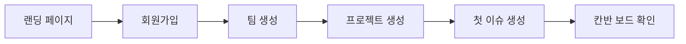
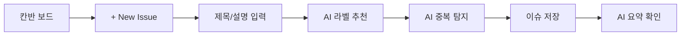
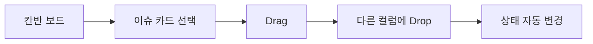
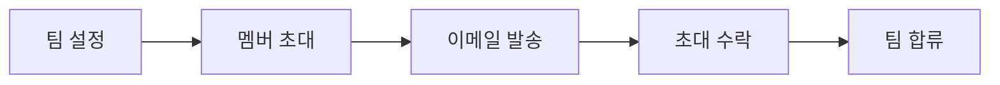
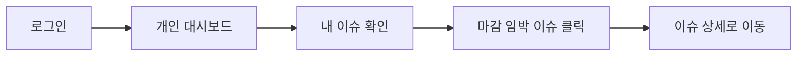

# Jira Lite MVP UX Design Specification

_Created on 2025-11-29 by hojeong_
_Generated using BMad Method - Create UX Design Workflow v1.0_

---

## Executive Summary

**프로젝트:** Jira Lite MVP - AI-Native 이슈 트래킹 웹 애플리케이션

8시간 해커톤 과제로, 기존 Jira의 복잡함을 덜어내고 AI 기능을 핵심 차별화 요소로 삼은 경량 이슈 트래킹 도구입니다.

### 프로젝트 비전
팀이 AI의 도움으로 더 빠르게 이슈를 관리하고 해결할 수 있게 해주는 스마트한 이슈 관리 경험을 제공합니다.

### 타겟 사용자
- **주요 사용자:** 소규모 개발팀, 스타트업
- **니즈:** 복잡한 설정 없이 빠르게 이슈 관리 시작
- **페인 포인트:** 기존 Jira의 학습 곡선, 과도한 기능, 느린 속도

### 핵심 기능 (58개 FR)
| 영역 | FR 범위 | 개수 |
|------|---------|------|
| 인증 | FR-001 ~ FR-007 | 7개 |
| 팀 | FR-010 ~ FR-019 | 10개 |
| 프로젝트 | FR-020 ~ FR-027 | 8개 |
| 이슈 | FR-030 ~ FR-039-2 | 11개 |
| AI | FR-040 ~ FR-045 | 6개 |
| 칸반 | FR-050 ~ FR-054 | 5개 |
| 댓글 | FR-060 ~ FR-063 | 4개 |
| 권한/보안 | FR-070 ~ FR-071 | 2개 |
| 대시보드 | FR-080 ~ FR-082 | 3개 |
| 알림 | FR-090 ~ FR-091 | 2개 |

### AI-Native 차별화 요소
1. **이슈 요약** - 긴 설명을 2~4문장으로 자동 요약
2. **해결 전략 제안** - AI가 이슈 해결 접근 방식 제안
3. **자동 라벨 추천** - 내용 기반 라벨 자동 분류
4. **중복 이슈 탐지** - 유사 이슈 경고로 중복 방지
5. **댓글 요약** - 긴 논의 스레드 핵심 요약

### 플랫폼
- **Primary:** 웹 애플리케이션
- **Responsive:** 모바일 반응형 지원

---

## 1. Design System Foundation

### 1.1 Design System Choice

**선택: shadcn/ui + Tailwind CSS + Radix UI**

| 항목 | 내용 |
|------|------|
| **디자인 시스템** | shadcn/ui |
| **스타일링** | Tailwind CSS |
| **프리미티브** | Radix UI (접근성) |
| **아이콘** | Lucide Icons |

**선택 근거:**
1. **경량** - 번들 사이즈 최소화, 빠른 로딩 (PRD: 3초 이내)
2. **Tailwind 네이티브** - Linear 스타일의 미니멀한 디자인 구현 용이
3. **Radix UI 기반** - WCAG 접근성 자동 준수
4. **코드 소유권** - 칸반 보드 등 특수 컴포넌트 완전 커스터마이징 가능
5. **2025 트렌드** - 현대적인 SaaS 디자인 패턴에 최적화

**shadcn/ui 제공 컴포넌트 활용:**

| 카테고리 | 컴포넌트 |
|----------|----------|
| **입력** | Button, Input, Textarea, Select, Checkbox, Switch |
| **레이아웃** | Card, Tabs, Sheet, Separator |
| **피드백** | Toast, Alert, Dialog, Tooltip |
| **데이터 표시** | Table, Badge, Avatar, Skeleton |
| **네비게이션** | Command (검색), Dropdown Menu, Navigation Menu |
| **날짜** | Calendar, Date Picker |

**커스텀 컴포넌트 개발 필요:**

| 컴포넌트 | 용도 | 복잡도 |
|----------|------|--------|
| KanbanBoard | 칸반 보드 전체 | 높음 |
| KanbanColumn | 상태별 컬럼 | 중간 |
| IssueCard | 이슈 카드 | 중간 |
| AIResultPanel | AI 요약/제안 표시 | 낮음 |
| DashboardChart | 통계 차트 | 중간 |
| PriorityBadge | 우선순위 표시 | 낮음 |
| LabelTag | 라벨 태그 | 낮음 |

---

## 2. Core User Experience

### 2.1 Defining Experience

**핵심 경험 정의:**

| 항목 | 내용 |
|------|------|
| **가장 자주 하는 행동** | 칸반 보드에서 이슈 카드 Drag & Drop으로 상태 변경 |
| **절대적으로 쉬워야 하는 것** | 이슈 생성, AI 기능 호출 (버튼 한 번 클릭) |
| **가장 중요한 사용자 액션** | 1) 칸반 보드 조작 2) AI 요약/제안 활용 3) 이슈 상세 관리 |

**한 문장 정의:** "AI가 알아서 도와주니까 나는 중요한 것에만 집중할 수 있는 칸반 보드"

**원하는 사용자 감정:**
- 효율적이고 생산적 (복잡한 설정 없이 바로 시작)
- 스마트하게 도움받는 느낌 (AI가 요약, 제안, 분류)
- 가볍고 빠른 (경량 트래커, 100ms 이내 반응)
- 통제감 (칸반 보드로 전체 현황 한눈에 파악)

**플랫폼 전략:**
- **Primary:** 데스크톱 웹 (1280px+)
- **Secondary:** 반응형 모바일 (필수 지원)
- **브라우저:** 모던 브라우저 (Chrome, Firefox, Safari, Edge)

### 2.2 영감 분석 및 UX 패턴

**영감 소스:**

| 앱 | UX 강점 | Jira Lite에 적용할 점 |
|-----|---------|---------------------|
| **Linear** | 깔끔한 UI, 낮은 시각적 노이즈, 빠른 반응 | 미니멀한 디자인, 계층 구조 명확화 |
| **Notion** | 유연한 뷰 전환, 커스터마이징 | 다양한 뷰 지원 (칸반/리스트) |
| **Trello** | 직관적인 Drag & Drop, 칸반의 정석 | 자연스러운 드래그 인터랙션 |

**적용할 핵심 UX 패턴:**
1. **Drag & Drop** - 물리적 느낌을 디지털로 (100ms 이내 반응, 마지막 드롭 존 기억)
2. **시각적 노이즈 최소화** - Linear 스타일의 깔끔한 계층 구조
3. **즉각적인 피드백** - 모든 액션에 시각적 피드백 제공
4. **AI 기능 접근성** - 버튼 한 번으로 AI 기능 호출

### 2.3 UX 복잡도 분석

| 지표 | 평가 |
|------|------|
| 사용자 역할 수 | 3개 (OWNER/ADMIN/MEMBER) |
| 주요 사용자 여정 | 5-6개 (이슈 생성, 상태 변경, AI 활용, 팀 관리, 대시보드) |
| 인터랙션 복잡도 | 중간 (Drag & Drop, 모달, 폼) |
| 플랫폼 요구사항 | 웹 (데스크톱 우선 + 모바일 반응형) |
| 실시간 협업 | 칸반 보드 (실시간 동기화 필요) |

**퍼실리테이션 모드:** UX_INTERMEDIATE (intermediate 스킬 레벨 기준)

---

## 3. Visual Foundation

### 3.1 Color System

**테마명: Linear Productivity**

Linear 스타일의 미니멀함 + AI 제품의 스마트한 느낌을 결합한 커스텀 테마입니다.

#### Primary Colors

| 용도 | 색상명 | HEX | 사용처 |
|------|--------|-----|--------|
| **Primary** | Indigo | `#5B5FC7` | 주요 버튼, 링크, 포커스 상태 |
| **Accent** | Blue | `#3B82F6` | AI 기능, 강조 요소 |
| **Text Primary** | Zinc 900 | `#18181B` | 제목, 본문 텍스트 |
| **Text Secondary** | Zinc 500 | `#71717A` | 보조 텍스트, 메타 정보 |
| **Background** | Zinc 50 | `#FAFAFA` | 페이지 배경 |
| **Surface** | White | `#FFFFFF` | 카드, 모달 배경 |
| **Border** | Zinc 200 | `#E4E4E7` | 구분선, 테두리 |

#### Semantic Colors

| 용도 | HEX | 사용처 |
|------|-----|--------|
| **Success** | `#22C55E` | 완료, 성공 메시지 |
| **Warning** | `#F59E0B` | 경고, 마감 임박 |
| **Error** | `#EF4444` | 에러, 삭제 |
| **Info** | `#3B82F6` | 정보, AI 로딩 |

#### Priority Colors

| 우선순위 | Background | Text |
|----------|------------|------|
| **HIGH** | `#FEE2E2` | `#DC2626` |
| **MEDIUM** | `#FEF3C7` | `#D97706` |
| **LOW** | `#DCFCE7` | `#16A34A` |

#### AI Feature Gradient

```css
background: linear-gradient(135deg, #5B5FC7 0%, #3B82F6 100%);
```

### 3.2 Typography

**Font Family:** Inter (Google Fonts)

| 용도 | Weight | Size | Line Height |
|------|--------|------|-------------|
| **H1** | Bold (700) | 32px | 1.2 |
| **H2** | Semibold (600) | 24px | 1.3 |
| **H3** | Semibold (600) | 20px | 1.4 |
| **Body** | Regular (400) | 16px | 1.6 |
| **Small** | Regular (400) | 14px | 1.5 |
| **Tiny** | Medium (500) | 12px | 1.4 |

### 3.3 Spacing System

**Base Unit:** 4px

| Token | Value | 사용처 |
|-------|-------|--------|
| `xs` | 4px | 아이콘 간격 |
| `sm` | 8px | 인라인 요소 간격 |
| `md` | 16px | 컴포넌트 내부 패딩 |
| `lg` | 24px | 섹션 간격 |
| `xl` | 32px | 카드 패딩 |
| `2xl` | 48px | 페이지 섹션 간격 |

### 3.4 Border Radius

| Token | Value | 사용처 |
|-------|-------|--------|
| `sm` | 4px | 태그, 뱃지 |
| `md` | 8px | 버튼, 입력 필드 |
| `lg` | 12px | 카드, 패널 |
| `xl` | 16px | 모달, 큰 카드 |

**Interactive Visualizations:**

- Color Theme Explorer: [ux-color-themes.html](./ux-color-themes.html)

---

## 4. Design Direction

### 4.1 Chosen Design Approach

**디자인 방향: Linear-Inspired Productivity**

Linear와 Notion의 디자인 패턴을 차용한 현대적이고 미니멀한 SaaS 스타일입니다.

#### Layout Decisions

| 결정 항목 | 선택 | 근거 |
|----------|------|------|
| **Navigation** | 좌측 Sidebar (240px) | 프로젝트/팀 전환이 빈번한 구조에 적합 |
| **Content Structure** | Single-column main | 칸반 보드의 수평 스크롤 허용 |
| **Card Layout** | 칸반 컬럼 (min-width: 280px) | Trello/Linear 표준 패턴 |
| **Detail Panel** | 우측 슬라이드 패널 (400px) | 컨텍스트 유지하며 이슈 상세 확인 |

#### Visual Hierarchy

| 결정 항목 | 선택 | 근거 |
|----------|------|------|
| **Density** | Balanced (적절한 여백) | 정보량과 가독성 균형 |
| **Header Emphasis** | Subtle (가벼운 강조) | 콘텐츠에 집중 |
| **Content Focus** | Card-based | 이슈 카드 중심 UI |
| **Visual Weight** | Minimal | Linear 스타일의 깔끔한 느낌 |

#### Interaction Decisions

| 결정 항목 | 선택 | 근거 |
|----------|------|------|
| **Primary Action** | 우측 상단 버튼 (+ New Issue) | 눈에 띄는 위치 |
| **Issue Action** | 슬라이드 패널 | 모달보다 컨텍스트 유지에 유리 |
| **State Change** | Drag & Drop | 칸반 보드 표준 패턴 |
| **AI Features** | 버튼 + 패널 표시 | 명확한 AI 기능 접근성 |

### 4.2 Key Screen Designs

#### Screen 1: Kanban Board (핵심 화면)

```
+------------------+--------------------------------+------------------+
| Sidebar          | Main Panel                     | Detail Panel     |
| - Logo           | - Header (Project + Actions)   | - Issue Title    |
| - Navigation     | - View Tabs (Board/List)       | - AI Summary     |
| - Projects       | - Filters                      | - Description    |
| - Team           | - Kanban Columns               | - Meta Info      |
|                  |   [Backlog][Progress][Done]    | - Comments       |
+------------------+--------------------------------+------------------+
```

**핵심 요소:**
- 4개 기본 컬럼 (Backlog, In Progress, Review, Done)
- 이슈 카드: ID, 제목, 우선순위, 라벨, 담당자, 서브태스크 진행률
- 드래그 중 시각적 피드백 (회전, 그림자)
- 우측 패널에 AI 요약/제안 통합

#### Screen 2: Dashboard

```
+------------------+------------------------------------------------+
| Sidebar          | Dashboard Grid                                 |
|                  | [My Issues Stats] [Project Progress]           |
|                  | [Status Chart]    [Activity Trend]             |
|                  | [Due Soon List - Full Width]                   |
+------------------+------------------------------------------------+
```

**핵심 요소:**
- 상태별 이슈 개수 (숫자 강조)
- 프로젝트 완료율 (프로그레스 바)
- 마감 임박 이슈 목록 (7일 이내)
- 차트: 상태별 분포, 활동 추이

#### Screen 3: Login/Sign Up

```
+------------------------+------------------------+
| Brand Section          | Form Section           |
| - Logo                 | - Title                |
| - Tagline              | - Email Input          |
| - Feature List         | - Password Input       |
|   (AI benefits)        | - Sign In Button       |
|                        | - Google OAuth Button  |
|                        | - Sign Up Link         |
+------------------------+------------------------+
```

**핵심 요소:**
- 좌측: 브랜드 및 AI 기능 강조 (그라디언트 배경)
- 우측: 깔끔한 로그인 폼
- Google OAuth 버튼 prominently 표시

**Interactive Mockups:**

- Design Direction Showcase: [ux-design-directions.html](./ux-design-directions.html)

### 4.3 Additional Screen Designs

#### Screen 4: Team Management (팀 관리)

```
+------------------+------------------------------------------------+
| Sidebar          | Team Settings                                  |
|                  | +--------------------------------------------+ |
|                  | | [Members] [Invites] [Activity] [Settings]  | |
|                  | +--------------------------------------------+ |
|                  | | Member List                    [+ Invite]  | |
|                  | | +------------------------------------------+|
|                  | | | Avatar | Name | Email | Role | Actions   ||
|                  | | | [HJ]   | Ho.. | h@..  | OWNER| -         ||
|                  | | | [SL]   | Se.. | s@..  | ADMIN| [▼]       ||
|                  | | | [KM]   | Ki.. | k@..  | MEMBER| [▼]      ||
|                  | +--------------------------------------------+ |
+------------------+------------------------------------------------+
```

**핵심 요소:**
- **멤버 목록 테이블**: Avatar, 이름, 이메일, 역할(OWNER/ADMIN/MEMBER), 액션
- **역할 드롭다운**: OWNER만 역할 변경 가능, 본인 역할은 비활성화
- **초대 버튼**: 우측 상단 Primary 버튼
- **탭 네비게이션**: Members, Pending Invites, Activity Log, Settings
- **권한별 UI**: OWNER/ADMIN만 초대 버튼 표시

**멤버 초대 모달:**
```
+----------------------------------+
| Invite Team Member          [X]  |
+----------------------------------+
| Email *                          |
| [________________________]       |
|                                  |
| Role                             |
| [MEMBER          ▼]              |
|                                  |
| [Cancel]        [Send Invite]    |
+----------------------------------+
```

#### Screen 5: Notifications (알림)

**알림 드롭다운 (헤더에서 접근):**
```
+--------------------------------+
| Notifications            [Mark all read]
+--------------------------------+
| 🔴 Issue assigned to you       |
|    JL-12: Email notification   |
|    2 minutes ago               |
+--------------------------------+
|    New comment on JL-8         |
|    Seulgi: "Looking good!"     |
|    1 hour ago                  |
+--------------------------------+
| 🔴 Due date approaching        |
|    JL-7: AI summary feature    |
|    Due tomorrow                |
+--------------------------------+
| [View all notifications →]     |
+--------------------------------+
```

**핵심 요소:**
- **헤더 아이콘**: 벨 아이콘 + 미읽음 개수 뱃지 (빨간색)
- **드롭다운**: 최대 5개 최신 알림 표시
- **알림 항목**: 아이콘, 제목, 설명, 시간, 읽음 상태 (🔴 = 미읽음)
- **전체 읽음**: 우측 상단 링크
- **알림 유형별 아이콘**:
  - 담당자 지정: 👤
  - 댓글: 💬
  - 마감일 임박: ⚠️
  - 팀 초대: 📧
  - 역할 변경: 🔑

**알림 전체 페이지:**
- 필터: 전체 / 미읽음 / 읽음
- 알림 유형별 필터
- 무한 스크롤 페이지네이션

#### Screen 6: Search & Filter (검색/필터)

**검색 Command Palette (Cmd+K):**
```
+----------------------------------------+
| 🔍 Search issues, projects, members... |
+----------------------------------------+
| Recent Searches                        |
|   authentication                       |
|   JL-8                                 |
+----------------------------------------+
| Quick Filters                          |
|   [My Issues] [Due Today] [HIGH]       |
+----------------------------------------+
| Results                                |
|   📋 JL-8: Build kanban board         |
|   📋 JL-12: Email notification        |
|   📁 Jira Lite MVP (Project)          |
+----------------------------------------+
```

**필터 드롭다운 상세:**

| 필터 | UI 타입 | 옵션 |
|------|---------|------|
| **Status** | Multi-select Checkbox | Backlog, In Progress, Review, Done, + Custom |
| **Priority** | Multi-select Checkbox | HIGH, MEDIUM, LOW |
| **Assignee** | Searchable Select | 팀 멤버 목록 + Unassigned |
| **Label** | Multi-select Chips | 프로젝트 라벨 목록 |
| **Due Date** | Date Range Picker | Today, This Week, This Month, Overdue, Custom Range |

**필터 적용 UI:**
```
+----------------------------------------------------+
| Filters: [Status: In Progress ×] [Priority: HIGH ×] |
|          [Clear all filters]                        |
+----------------------------------------------------+
```

#### Screen 7: Profile Settings (프로필 설정)

```
+------------------+------------------------------------------------+
| Sidebar          | Profile Settings                               |
|                  | +--------------------------------------------+ |
|                  | | [Profile] [Security] [Preferences]         | |
|                  | +--------------------------------------------+ |
|                  | |  +-------+                                 | |
|                  | |  | [IMG] |  Change Photo                   | |
|                  | |  +-------+                                 | |
|                  | |                                            | |
|                  | |  Name *                                    | |
|                  | |  [Hojeong________________]                 | |
|                  | |                                            | |
|                  | |  Email (read-only)                         | |
|                  | |  [hojeong@example.com___] 🔒               | |
|                  | |                                            | |
|                  | |  [Cancel]              [Save Changes]      | |
|                  | +--------------------------------------------+ |
+------------------+------------------------------------------------+
```

**프로필 탭 구성:**

| 탭 | 내용 |
|----|------|
| **Profile** | 이름, 프로필 이미지 변경 |
| **Security** | 비밀번호 변경, 계정 삭제 |
| **Preferences** | 알림 설정, 언어, 테마 |

**프로필 이미지 업로드:**
- 클릭 시 파일 선택 다이얼로그
- 드래그 앤 드롭 지원
- 지원 형식: JPG, PNG (최대 5MB)
- 프리뷰 표시 후 저장

#### Screen 8: Account Deletion (계정 삭제)

**계정 삭제 플로우:**

```
Step 1: Security Tab에서 "Delete Account" 클릭
           ↓
Step 2: 경고 모달 표시
           ↓
Step 3: 비밀번호 재입력 (OAuth 사용자는 확인 버튼만)
           ↓
Step 4: 소유 팀 체크 → 있으면 차단, 없으면 진행
           ↓
Step 5: 최종 확인 후 Soft Delete
```

**경고 모달 (Step 2):**
```
+------------------------------------------+
| ⚠️ Delete Account                   [X]  |
+------------------------------------------+
| Are you sure you want to delete your     |
| account? This action cannot be undone.   |
|                                          |
| What will be deleted:                    |
| • Your profile and personal data         |
| • Your comments and activity history     |
| • Team memberships (not owned teams)     |
|                                          |
| ⚠️ You own 1 team. Please delete or     |
|    transfer ownership before proceeding. |
|                                          |
| [Cancel]              [Continue →]       |
+------------------------------------------+
```

**비밀번호 확인 모달 (Step 3):**
```
+------------------------------------------+
| Confirm Account Deletion            [X]  |
+------------------------------------------+
| Enter your password to confirm:          |
|                                          |
| Password                                 |
| [________________________]               |
|                                          |
| Type "DELETE" to confirm:                |
| [________________________]               |
|                                          |
| [Cancel]     [Delete My Account]         |
+------------------------------------------+
```

**핵심 요소:**
- **Destructive 버튼 스타일**: 빨간색 배경 (`#EF4444`)
- **다단계 확인**: 실수 방지를 위한 3단계 확인
- **소유 팀 차단**: OWNER인 팀이 있으면 삭제 불가, 안내 메시지 표시
- **OAuth 사용자**: 비밀번호 대신 "DELETE" 텍스트 입력만 요구

### 4.4 Component Detail Specifications

#### Password Change Form (FR-006)

```
+------------------------------------------+
| Change Password                          |
+------------------------------------------+
| Current Password *                       |
| [________________________] 👁             |
|                                          |
| New Password *                           |
| [________________________] 👁             |
| ○○○○○○ Strength: Weak                   |
|                                          |
| Confirm New Password *                   |
| [________________________] 👁             |
|                                          |
| [Cancel]              [Update Password]  |
+------------------------------------------+
```

**비밀번호 강도 표시:**
- Weak: 빨간색 (6자 미만 또는 숫자만)
- Medium: 노란색 (6자 이상, 문자+숫자)
- Strong: 초록색 (8자 이상, 문자+숫자+특수문자)

**Google OAuth 사용자:**
- 비밀번호 변경 섹션 비활성화
- 안내 메시지: "Google 계정으로 로그인하셨습니다. 비밀번호는 Google에서 관리됩니다."

#### Comment Input (FR-060)

```
+------------------------------------------+
| +-------+  Write a comment...            |
| | [HJ]  |  [____________________________]|
| +-------+  [@ Mention] [📎] [Send →]     |
+------------------------------------------+
```

**핵심 요소:**
- 입력창 좌측에 현재 사용자 아바타
- Placeholder: "Write a comment..."
- 멘션 기능: @ 입력 시 팀원 자동완성
- 첨부 버튼 (향후 확장용)
- Enter로 전송, Shift+Enter로 줄바꿈

#### AI Rate Limit UI (FR-042)

**Rate Limit 정책:**
- 사용자당 분당 10회 제한
- 또는 일당 100회 제한

**AI 버튼 상태:**

| 상태 | UI 표시 |
|------|---------|
| **사용 가능** | 기본 AI 그라디언트 버튼 |
| **요청 중** | 버튼 비활성화 + Spinner + "Analyzing..." |
| **제한 도달** | 버튼 비활성화 + 회색 처리 + 툴팁 표시 |

**Rate Limit 에러 Toast:**
```
+--------------------------------------------------+
| ⚠️ AI Rate Limit Reached                    [×]  |
|                                                  |
| You've reached the AI usage limit.               |
| Try again in 45 seconds.                         |
|                                                  |
| Remaining today: 0/100                           |
+--------------------------------------------------+
```

**AI 패널 Rate Limit 상태:**
```
+------------------------------------------+
| AI Summary                               |
+------------------------------------------+
| ⚠️ Rate limit reached                    |
|                                          |
| You can use AI features again in:        |
|          ⏱️ 0:45                         |
|                                          |
| Daily usage: 100/100                     |
+------------------------------------------+
```

**핵심 요소:**
- **Toast 위치**: 우측 하단, 5초 후 자동 dismiss
- **Toast 색상**: Warning 스타일 (노란색 배경 `#FEF3C7`)
- **남은 시간 표시**: 실시간 카운트다운
- **일일 사용량**: 분모/분자 형식으로 표시
- **버튼 툴팁**: 호버 시 "Rate limit reached. Try again in X seconds"

**AI 버튼 비활성화 시 스타일:**
```css
.ai-btn-disabled {
  background: #E4E4E7;  /* Zinc 200 */
  color: #A1A1AA;       /* Zinc 400 */
  cursor: not-allowed;
  opacity: 0.6;
}
```

**Rate Limit 해제 시:**
- Toast: "AI features are available again!" (Success 스타일, 3초)
- 버튼 자동 활성화 (그라디언트 복원)

---

## 5. User Journey Flows

### 5.1 Critical User Paths

PRD 기반 핵심 사용자 여정 5가지:

#### Journey 1: 신규 사용자 온보딩



| 단계 | 화면 | 사용자 액션 | 시스템 응답 |
|------|------|------------|------------|
| 1 | Login | Sign Up 클릭 | 회원가입 폼 표시 |
| 2 | Sign Up | 이메일/비밀번호 입력 | 계정 생성, 로그인 |
| 3 | Empty State | 팀 생성 버튼 클릭 | 팀 생성 모달 |
| 4 | Team Created | 프로젝트 생성 | 프로젝트 생성 모달 |
| 5 | Project | + New Issue 클릭 | 이슈 생성 폼 |
| 6 | Kanban | 이슈 확인 | 칸반 보드에 카드 표시 |

#### Journey 2: 이슈 생성 및 AI 활용



| 단계 | 사용자 액션 | AI 기능 |
|------|------------|---------|
| 1 | + New Issue 클릭 | - |
| 2 | 제목 입력 | 중복 이슈 탐지 (FR-044) |
| 3 | 설명 입력 (10자 이상) | 라벨 자동 추천 (FR-043) |
| 4 | 라벨 선택/수락 | - |
| 5 | 저장 | - |
| 6 | 이슈 상세 열기 | AI 요약 버튼 표시 (FR-040) |
| 7 | AI 요약 클릭 | 2-4문장 요약 생성 |

#### Journey 3: 칸반 보드 작업



| 단계 | 사용자 액션 | 시스템 응답 |
|------|------------|------------|
| 1 | 이슈 카드 클릭 & 홀드 | 카드 들어올림 효과 (그림자, 회전) |
| 2 | 다른 컬럼으로 드래그 | 드롭 존 하이라이트 |
| 3 | 드롭 | 상태 변경, 히스토리 기록 |
| 4 | (선택) 같은 컬럼 내 순서 변경 | position 업데이트 |

#### Journey 4: 팀 협업



| 단계 | 권한 | 사용자 액션 |
|------|------|------------|
| 1 | OWNER/ADMIN | 멤버 초대 클릭 |
| 2 | OWNER/ADMIN | 이메일 입력 |
| 3 | 시스템 | 초대 이메일 발송 |
| 4 | 초대받은 사용자 | 이메일 링크 클릭 |
| 5 | 초대받은 사용자 | 팀 가입 (MEMBER로) |

#### Journey 5: 대시보드 확인



---

## 6. Component Library

### 6.1 Component Strategy

#### shadcn/ui 기본 컴포넌트 (직접 사용)

| 컴포넌트 | 사용처 | 커스터마이징 |
|----------|--------|-------------|
| Button | 모든 버튼 | Primary, Secondary, Destructive, AI 변형 추가 |
| Input | 폼 입력 | 에러 상태 스타일 추가 |
| Textarea | 이슈 설명 | 자동 높이 조절 |
| Select | 상태, 우선순위 선택 | - |
| Dialog | 생성/수정 모달 | - |
| Sheet | 이슈 상세 패널 | 우측 슬라이드 |
| Toast | 알림 메시지 | 4가지 변형 (success, error, warning, info) |
| Avatar | 사용자 프로필 | 이니셜 fallback |
| Badge | 우선순위, 라벨 | 색상 변형 |
| Card | 이슈 카드, 대시보드 카드 | - |
| Table | 이슈 리스트 뷰 | - |
| Tabs | 뷰 전환 (Board/List) | - |
| Dropdown Menu | 컨텍스트 메뉴 | - |
| Command | 검색 | - |
| Calendar | 마감일 선택 | - |
| Skeleton | 로딩 상태 | - |

#### 커스텀 컴포넌트 (개발 필요)

| 컴포넌트 | 용도 | 구성 요소 |
|----------|------|----------|
| **KanbanBoard** | 칸반 보드 전체 | columns, drag context |
| **KanbanColumn** | 상태별 컬럼 | header, cards, add button |
| **IssueCard** | 이슈 카드 | id, title, priority, labels, assignee, due, subtasks |
| **IssueDetailPanel** | 이슈 상세 | Sheet 기반, AI 패널 포함 |
| **AIPanel** | AI 결과 표시 | header, content, actions |
| **PriorityBadge** | 우선순위 뱃지 | HIGH/MEDIUM/LOW 변형 |
| **LabelTag** | 라벨 태그 | 동적 색상 |
| **DashboardStatCard** | 통계 카드 | value, label, trend |
| **ActivityTimeline** | 활동 로그 | avatar, action, time |
| **NotificationItem** | 알림 항목 | type, message, time, read status |

### 6.2 Component States

모든 인터랙티브 컴포넌트는 다음 상태를 지원해야 합니다:

| 상태 | 설명 |
|------|------|
| **Default** | 기본 상태 |
| **Hover** | 마우스 오버 |
| **Focus** | 키보드 포커스 (접근성) |
| **Active** | 클릭/터치 중 |
| **Disabled** | 비활성화 |
| **Loading** | 로딩 중 (Skeleton 또는 Spinner) |
| **Error** | 에러 상태 (입력 필드) |

---

## 7. UX Pattern Decisions

### 7.1 Consistency Rules

PRD 기반 UX 패턴 결정:

#### Button Hierarchy

| 유형 | 스타일 | 사용처 |
|------|--------|--------|
| **Primary** | Indigo 배경, 흰색 텍스트 | 주요 액션 (저장, 생성) |
| **Secondary** | 회색 배경, 테두리 | 보조 액션 (취소, 필터) |
| **Destructive** | 빨간색 배경 | 삭제 액션 |
| **AI** | 그라디언트 배경 | AI 기능 호출 |
| **Ghost** | 투명 배경 | 아이콘 버튼, 링크 |

#### Feedback Patterns

| 상황 | 패턴 | 예시 |
|------|------|------|
| **Success** | Toast (우측 하단, 3초) | "이슈가 생성되었습니다" |
| **Error** | Toast + Inline | "저장에 실패했습니다" + 필드 에러 |
| **Warning** | Toast (5초) | "마감일이 임박했습니다" |
| **Loading** | Skeleton + Spinner | 데이터 로딩 시 |
| **AI Loading** | Pulse 애니메이션 | "AI가 분석 중..." |

#### Form Patterns

| 항목 | 결정 |
|------|------|
| **Label 위치** | Input 위 (Above) |
| **필수 표시** | 라벨 옆 빨간 * |
| **Validation 시점** | onBlur (포커스 이탈 시) |
| **Error 표시** | Input 아래 빨간 텍스트 |
| **Help 텍스트** | Input 아래 회색 텍스트 |

#### Modal Patterns

| 항목 | 결정 |
|------|------|
| **Size** | Small (400px), Medium (560px), Large (720px) |
| **Dismiss** | 외부 클릭, ESC 키, X 버튼 |
| **Focus** | 첫 번째 입력 필드에 자동 포커스 |
| **Stacking** | 허용하지 않음 (하나만 열림) |

#### Navigation Patterns

| 항목 | 결정 |
|------|------|
| **Active 표시** | Primary 배경색 |
| **Breadcrumb** | 프로젝트 > 이슈 상세 |
| **Back 버튼** | 앱 내 네비게이션 (브라우저 back과 동기화) |

#### Empty State Patterns

| 상황 | 표시 내용 |
|------|----------|
| **첫 사용** | 일러스트 + 설명 + CTA 버튼 |
| **검색 결과 없음** | "검색 결과가 없습니다" + 검색어 확인 안내 |
| **이슈 없음** | "이슈가 없습니다" + 새 이슈 만들기 버튼 |

#### Confirmation Patterns

| 액션 | 확인 방식 |
|------|----------|
| **이슈 삭제** | 확인 모달 ("정말 삭제하시겠습니까?") |
| **팀 삭제** | 확인 모달 + 팀명 입력 |
| **계정 삭제** | 확인 모달 + 비밀번호 재입력 |
| **페이지 이탈 (미저장)** | 브라우저 confirm |

#### Notification Patterns

| 항목 | 결정 |
|------|------|
| **위치** | 헤더 우측 벨 아이콘 |
| **미읽음 표시** | 빨간 뱃지 (개수) |
| **Duration** | 자동 사라지지 않음 (사용자가 읽음 처리) |
| **Priority** | 빨간 점으로 중요 알림 구분 |

---

## 8. Responsive Design & Accessibility

### 8.1 Responsive Strategy

**접근 방식:** 데스크톱 우선 (Desktop-First) + 반응형 축소

#### Breakpoints

| 이름 | 범위 | 레이아웃 |
|------|------|----------|
| **Desktop** | 1280px+ | 전체 레이아웃 (Sidebar + Main + Detail Panel) |
| **Laptop** | 1024px - 1279px | Sidebar 축소 (아이콘만), Detail Panel 오버레이 |
| **Tablet** | 768px - 1023px | Sidebar 숨김 (햄버거 메뉴), 단일 컬럼 |
| **Mobile** | < 768px | 전체 화면 단일 뷰, 바텀 네비게이션 |

#### Adaptation Patterns

| 요소 | Desktop | Tablet | Mobile |
|------|---------|--------|--------|
| **Sidebar** | 240px 고정 | 60px (아이콘) | 숨김 (햄버거) |
| **Kanban** | 수평 스크롤 | 수평 스크롤 | 단일 컬럼 스와이프 |
| **Detail Panel** | 400px 고정 | 오버레이 (전체) | 전체 화면 |
| **Forms** | 2컬럼 | 1컬럼 | 1컬럼 |
| **Navigation** | Sidebar | Sidebar (축소) | Bottom Nav |

#### Mobile-Specific Considerations

- **Touch Target:** 최소 44x44px
- **Drag & Drop:** 터치 드래그 지원 (길게 누르기로 시작)
- **스와이프:** 칸반 컬럼 간 스와이프 전환
- **Pull to Refresh:** 목록 새로고침

### 8.2 Accessibility Strategy

**목표:** WCAG 2.1 Level AA 준수

#### Color Contrast

| 요소 | 최소 비율 |
|------|----------|
| **일반 텍스트** | 4.5:1 |
| **큰 텍스트 (18px+)** | 3:1 |
| **UI 컴포넌트** | 3:1 |

#### Keyboard Navigation

| 키 | 동작 |
|----|------|
| **Tab** | 다음 포커스 요소로 이동 |
| **Shift + Tab** | 이전 포커스 요소로 이동 |
| **Enter** | 버튼 클릭, 링크 이동 |
| **Space** | 체크박스 토글, 버튼 클릭 |
| **Escape** | 모달/패널 닫기 |
| **Arrow Keys** | 드롭다운, 목록 탐색 |

#### Focus Indicators

- 모든 인터랙티브 요소에 visible focus ring
- Primary 색상 기반 (rgba(91, 95, 199, 0.3))
- `outline: 2px solid; outline-offset: 2px;`

#### ARIA Labels

| 요소 | ARIA 속성 |
|------|-----------|
| **이슈 카드** | `role="button"`, `aria-label="이슈 JL-8: 제목"` |
| **칸반 컬럼** | `role="region"`, `aria-label="In Progress, 2개 이슈"` |
| **드래그 가능** | `aria-grabbed`, `aria-dropeffect` |
| **알림 뱃지** | `aria-label="3개의 읽지 않은 알림"` |

#### Screen Reader Support

- 모든 이미지에 alt 텍스트
- 폼 라벨과 입력 연결 (`htmlFor`)
- 에러 메시지 `aria-live="polite"`로 알림
- 로딩 상태 `aria-busy="true"`

---

## 9. Implementation Guidance

### 9.1 Completion Summary

**Jira Lite MVP UX Design Specification이 완료되었습니다.**

#### 결정 사항 요약

| 항목 | 결정 |
|------|------|
| **디자인 시스템** | shadcn/ui + Tailwind CSS + Radix UI |
| **색상 테마** | Linear Productivity (Indigo Primary + Blue Accent) |
| **디자인 방향** | Linear-Inspired Minimal SaaS |
| **레이아웃** | Sidebar + Main + Detail Panel |
| **핵심 패턴** | Drag & Drop 칸반, AI 패널, Toast 피드백 |
| **반응형** | Desktop-First, 4단계 Breakpoint |
| **접근성** | WCAG 2.1 Level AA |

#### 산출물

| 파일 | 설명 |
|------|------|
| `docs/ux-design-specification.md` | UX 디자인 사양 문서 (본 문서) |
| `docs/ux-color-themes.html` | 인터랙티브 색상 테마 시각화 |
| `docs/ux-design-directions.html` | 디자인 방향 목업 (3개 화면) |

### 9.2 Implementation Priority

PRD 기반 구현 우선순위:

| 우선순위 | 화면/기능 | FR 참조 |
|----------|----------|---------|
| **P0** | 로그인/회원가입 | FR-001~004 |
| **P0** | 칸반 보드 | FR-050~052 |
| **P0** | 이슈 CRUD | FR-030~035 |
| **P1** | AI 요약/제안 | FR-040~041 |
| **P1** | 팀/프로젝트 관리 | FR-010~027 |
| **P2** | 대시보드 | FR-080~082 |
| **P2** | 알림 | FR-090~091 |
| **P2** | 나머지 AI 기능 | FR-043~045 |

### 9.3 Developer Handoff Notes

#### Tailwind CSS 설정

```javascript
// tailwind.config.js
module.exports = {
  theme: {
    extend: {
      colors: {
        primary: '#5B5FC7',
        accent: '#3B82F6',
      },
      fontFamily: {
        sans: ['Inter', 'sans-serif'],
      },
    },
  },
}
```

#### 핵심 라이브러리 추천

| 용도 | 라이브러리 |
|------|-----------|
| **Drag & Drop** | @dnd-kit/core, @dnd-kit/sortable |
| **차트** | recharts 또는 Chart.js |
| **날짜** | date-fns |
| **폼** | react-hook-form + zod |
| **상태관리** | Zustand 또는 Jotai |
| **API** | TanStack Query (React Query) |

---

## Appendix

### Related Documents

- Product Requirements: `docs/prd.md`

### Core Interactive Deliverables

This UX Design Specification was created through visual collaboration:

- **Color Theme Visualizer**: docs/ux-color-themes.html
- **Design Direction Mockups**: docs/ux-design-directions.html

### Version History

| Date | Version | Changes | Author |
| ---- | ------- | ------- | ------ |
| 2025-11-29 | 1.0 | Initial UX Design Specification | hojeong |

---

_This UX Design Specification was created through collaborative design facilitation, not template generation. All decisions were made with user input and are documented with rationale._
